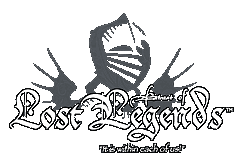
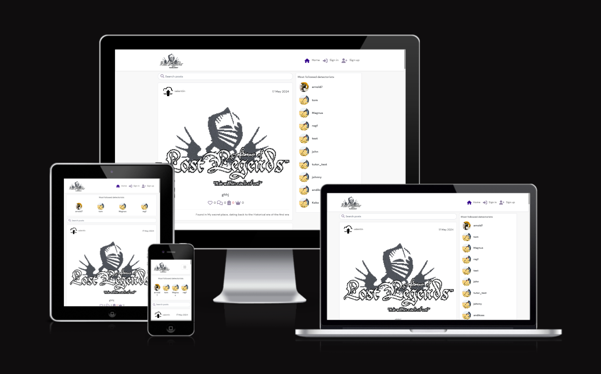

# LOST LEGENDS

Lost Legends is your ultimate destination for all things metal detecting. Whether you're a seasoned detectorist, an enthusiast, or simply intrigued by the world of treasure hunting, Lost Legends has got you covered. Unearth and share your metal detecting adventures, from uncovering ancient relics to discovering hidden treasures, by uploading captivating photos accompanied by thrilling stories.

Connect with fellow detectorists, exchange tips and techniques, and immerse yourself in a community of passionate treasure hunters. Explore the depths of history and uncover lost artifacts while forging meaningful connections with like-minded individuals who share your passion for uncovering the past.

With Lost Legends, your metal detecting journeys are beautifully documented, easily accessible, and ready to be shared with friends, family, and the global metal detecting community. Join Lost Legends today and embark on a journey of discovery, connection, and endless adventure in the world of metal detecting.

-  [Live App](https://lost-legends-ll-cdb0cf75519a.herokuapp.com/)
-  [API](https://drfapill-6d3c36398683.herokuapp.com/)
- [API Repository](https://github.com/arnoldkoss/drf-api-ll)

## Table of Content

### User Experience

Lost Legends is a social platform tailored for metal detecting enthusiasts worldwide. Explore remarkable finds, share your discoveries, and connect with fellow adventurers. Join us in celebrating the thrill of uncovering hidden treasures and preserving stories from the past.

### Objective
The objective of Lost Legends is to provide a dedicated social platform for metal detecting enthusiasts, bringing together individuals passionate about uncovering historical artifacts, sharing their finds, exchanging tips and stories, and fostering a vibrant community around the exciting world of metal detecting.

### Strategy
-  Create a Metal Detecting Social Media App: Develop a user-friendly web application that enables metal detecting enthusiasts to showcase their finds and share their experiences with a community of like-minded individuals. Provide easy-to-use features for users to upload images of their discoveries, write descriptions, and categorize their finds. Allow users to engage with content by commenting, saving, and liking posts.
- Forge a Metal Detecting Community: Cultivate an active community of metal detecting enthusiasts by facilitating connections between users, enabling them to follow each other and engage with shared content. Incorporate robust search, filter, and categorization functionalities to enhance the exploration of metal detecting finds and experiences.
- Facilitate Effortless Metal Detecting Exploration: Introduce functionalities that streamline the metal detecting exploration journey, empowering users to search and filter content by various criteria like username, popularity, date, title, content keywords, and category. Deliver an intuitive search feature that enables users to quickly discover relevant metal detecting finds and resources, enhancing their exploration experience.
- Deliver an Elegant and Intuitive User Interface: Craft a visually appealing and intuitive interface reminiscent of a metal detecting journal. Adhere to accessibility standards, integrate UX design best practices, and offer user interactions that seamlessly guide users through the platform. Employ responsive design techniques to guarantee accessibility and functionality across various devices, enhancing the user experience for all metal detecting enthusiasts.

### User Goals
-  Capture and Preserve Metal Detecting Adventures: Users aim to document and safeguard their metal detecting adventures, including photos, anecdotes, and notable discoveries, in a secure and structured format.
-  Share Metal Detecting Experiences: Users aspire to share their metal detecting experiences with others, providing inspiration and fostering connections within the metal detecting community.
-  Discover New Metal Detecting Locations: Users are eager to explore new metal detecting locations and uncover valuable recommendations and tips shared by fellow community members.
- Connect with Fellow Detectorists: Users seek to connect with fellow detectorists, follow their adventures, and engage in enriching discussions and interactions within the metal detecting community.
- Plan Future Metal Detecting Adventures: Users seek inspiration and resources to plan their future metal detecting adventures, including destination-specific information, safety guidelines, and equipment checklists
- Curate a Personal Wishlist: Users aspire to create their own wishlist of metal detecting finds and experiences they wish to explore in the future.
- Access a User-Friendly Platform: Users expect a user-friendly and intuitive platform that is easy to navigate, provides a seamless uploading and sharing experience, and offers search and filter functionalities for finding relevant content.

### Site Owner Goals
- Establish a Thriving Metal Detecting Community: The site owner endeavors to build a vibrant community of metal detecting enthusiasts who actively engage, connect, and share their metal detecting experiences and discoveries.
- Facilitate Content Sharing: The site owner aims to provide a platform where users can effortlessly upload, organize, and share their metal detecting finds, fostering a culture of discovery and inspiration.
- Drive User Engagement: The site owner seeks to promote user interaction by incorporating features like likes, comments, and following options, fostering an engaging and supportive community of metal detecting enthusiasts.
- Enhance User Experience: The site owner is committed to providing a seamless and enjoyable user experience by offering an aesthetically pleasing design, intuitive navigation, and responsive interface that caters to users' needs across various devices.
- Promote Metal Detecting Exploration: The site owner aims to facilitate metal detecting exploration by offering features such as search, filtering, categorization, and detailed information on metal detecting finds. These tools empower users to discover new finds, plan their detecting expeditions, and unearth hidden treasures.
- Monetization Opportunities: The site owner may explore monetization avenues such as partnerships, advertising, or premium features that enhance the user experience and provide additional value to the metal detecting community.

### Target Audience

- Metal Detecting Enthusiasts: Individuals who are passionate about metal detecting and are enthusiastic about documenting and sharing their finds and experiences within the metal detecting community.
- Exploration Enthusiasts: Individuals who are eager to explore new places, uncover hidden treasures, and share their discoveries with others in the metal detecting community.
- Tale Sharers: Users who delight in recounting their metal detecting adventures and captivating fellow enthusiasts with stories of their finds and experiences.
- Metal Detecting Planners: Individuals who are planning their upcoming metal detecting expeditions and are looking for inspiration, tips, and resources to enhance their treasure hunting experiences.
- Metal Detecting Community Members: Enthusiasts who appreciate being part of a dynamic community of fellow metal detectorists, exchanging knowledge, sharing finds, and connecting with like-minded individuals.
