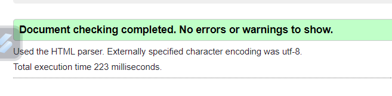
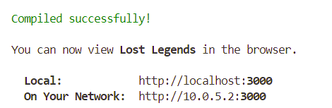

# LOST LEGENDS

Lost Legends is your ultimate destination for all things metal detecting. Whether you're a seasoned detectorist, an enthusiast, or simply intrigued by the world of treasure hunting, Lost Legends has got you covered. Unearth and share your metal detecting adventures, from uncovering ancient relics to discovering hidden treasures, by uploading captivating photos accompanied by thrilling stories.

Connect with fellow detectorists, exchange tips and techniques, and immerse yourself in a community of passionate treasure hunters. Explore the depths of history and uncover lost artifacts while forging meaningful connections with like-minded individuals who share your passion for uncovering the past.

With Lost Legends, your metal detecting journeys are beautifully documented, easily accessible, and ready to be shared with friends, family, and the global metal detecting community. Join Lost Legends today and embark on a journey of discovery, connection, and endless adventure in the world of metal detecting.

-  [Live App](https://lost-legends-ll-cdb0cf75519a.herokuapp.com/)
-  [API](https://drfapill-6d3c36398683.herokuapp.com/)
- [API Repository](https://github.com/arnoldkoss/drf-api-ll)

## Table of Content

1. [Lost Legends](#lost-legends)
   - [Overview](#overview)
   - [Live App](#live-app)
   - [API](#api)
   - [API Repository](#api-repository)

2. [User Experience](#user-experience)
   - [Objective](#objective)
   - [Strategy](#strategy)
   - [User Goals](#user-goals)
   - [Site Owner Goals](#site-owner-goals)
   - [Target Audience](#target-audience)
   - [User Requirements and Expectations](#user-requirements-and-expectations)

3. [Scope](#scope)
   - [User Account Management](#user-account-management)
   - [Post Management](#post-management)
   - [Interactions and Engagement](#interactions-and-engagement)
   - [Navigation](#navigation)
   - [Metal Detecting Discovery Management](#metal-detecting-discovery-management)
   - [Future Features](#future-features)

4. [User Stories](#user-stories)

5. [Structure](#structure)
   - [Database](#database)
   - [Component Architecture and Reusability](#component-architecture-and-reusability)
   - [Core Components](#core-components)
   - [Component Pages](#component-pages)
   - [Detectorists](#detectorists)

6. [Design Choices](#design-choices)
   - [Colour](#colour)
   - [Typography](#typography)

7. [Technologies Used](#technologies-used)
   - [Languages](#languages)
   - [Frameworks](#frameworks)
   - [Database](#database-1)
   - [Tools](#tools)
   - [Supporting Libraries and Packages](#supporting-libraries-and-packages)

8. [Methodology](#methodology)
   - [Agile Project Management with GitHub Projects](#agile-project-management-with-github-projects)
   - [User Stories as GitHub Issues](#user-stories-as-github-issues)
   - [Iterative Development Approach](#iterative-development-approach)
   - [Backlog and Subsequent Iterations](#backlog-and-subsequent-iterations)

9. [Bugs](#bugs)
   - [Fixed Bugs](#fixed-bugs)

10. [Testing](#testing)
    - [Code Quality and Validation](#code-quality-and-validation)
    - [Performance](#performance)
    - [Browser Compatibility](#browser-compatibility)
    - [Automated Testing](#automated-testing)
    - [Manual Testing](#manual-testing)
        - [User Account Management](#user-account-management)
        - [Post (CRUD) Management](#post-crud-management)
        - [Interactions and Engagement](#interactions-and-engagement)
        - [Full Testing Unauthorized User](#full-testing-unauthorized-user)
        - [Authorized User](#authorized-user)

11. [Deployment](#deployment)

12. [Acknowledgements](#acknowledgements)

### User Experience

Lost Legends is a social platform tailored for metal detecting enthusiasts worldwide. Explore remarkable finds, share your discoveries, and connect with fellow adventurers. Join us in celebrating the thrill of uncovering hidden treasures and preserving stories from the past.

### Objective
The objective of Lost Legends is to provide a dedicated social platform for metal detecting enthusiasts, bringing together individuals passionate about uncovering historical artifacts, sharing their finds, exchanging tips and stories, and fostering a vibrant community around the exciting world of metal detecting.

### Strategy
-  Create a Metal Detecting Social Media App: Develop a user-friendly web application that enables metal detecting enthusiasts to showcase their finds and share their experiences with a community of like-minded individuals. Provide easy-to-use features for users to upload images of their discoveries, write descriptions, and categorize their finds. Allow users to engage with content by commenting, saving, and liking posts.
- Forge a Metal Detecting Community: Cultivate an active community of metal detecting enthusiasts by facilitating connections between users, enabling them to follow each other and engage with shared content. Incorporate robust search, filter, and categorization functionalities to enhance the exploration of metal detecting finds and experiences.
- Facilitate Effortless Metal Detecting Exploration: Introduce functionalities that streamline the metal detecting exploration journey, empowering users to search and filter content by various criteria like username, popularity, date, title, content keywords, and category. Deliver an intuitive search feature that enables users to quickly discover relevant metal detecting finds and resources, enhancing their exploration experience.
- Deliver an Elegant and Intuitive User Interface: Craft a visually appealing and intuitive interface reminiscent of a metal detecting journal. Adhere to accessibility standards, integrate UX design best practices, and offer user interactions that seamlessly guide users through the platform. Employ responsive design techniques to guarantee accessibility and functionality across various devices, enhancing the user experience for all metal detecting enthusiasts.

### User Goals
-  Capture and Preserve Metal Detecting Adventures: Users aim to document and safeguard their metal detecting adventures, including photos, anecdotes, and notable discoveries, in a secure and structured format.
-  Share Metal Detecting Experiences: Users aspire to share their metal detecting experiences with others, providing inspiration and fostering connections within the metal detecting community.
-  Discover New Metal Detecting Locations: Users are eager to explore new metal detecting locations and uncover valuable recommendations and tips shared by fellow community members.
- Connect with Fellow Detectorists: Users seek to connect with fellow detectorists, follow their adventures, and engage in enriching discussions and interactions within the metal detecting community.
- Plan Future Metal Detecting Adventures: Users seek inspiration and resources to plan their future metal detecting adventures, including destination-specific information, safety guidelines, and equipment checklists
- Curate a Personal Wishlist: Users aspire to create their own wishlist of metal detecting finds and experiences they wish to explore in the future.
- Access a User-Friendly Platform: Users expect a user-friendly and intuitive platform that is easy to navigate, provides a seamless uploading and sharing experience, and offers search and filter functionalities for finding relevant content.

### Site Owner Goals
- Establish a Thriving Metal Detecting Community: The site owner endeavors to build a vibrant community of metal detecting enthusiasts who actively engage, connect, and share their metal detecting experiences and discoveries.
- Facilitate Content Sharing: The site owner aims to provide a platform where users can effortlessly upload, organize, and share their metal detecting finds, fostering a culture of discovery and inspiration.
- Drive User Engagement: The site owner seeks to promote user interaction by incorporating features like likes, comments, and following options, fostering an engaging and supportive community of metal detecting enthusiasts.
- Enhance User Experience: The site owner is committed to providing a seamless and enjoyable user experience by offering an aesthetically pleasing design, intuitive navigation, and responsive interface that caters to users' needs across various devices.
- Promote Metal Detecting Exploration: The site owner aims to facilitate metal detecting exploration by offering features such as search, filtering, categorization, and detailed information on metal detecting finds. These tools empower users to discover new finds, plan their detecting expeditions, and unearth hidden treasures.
- Monetization Opportunities: The site owner may explore monetization avenues such as partnerships, advertising, or premium features that enhance the user experience and provide additional value to the metal detecting community.

### Target Audience

- Metal Detecting Enthusiasts: Individuals who are passionate about metal detecting and are enthusiastic about documenting and sharing their finds and experiences within the metal detecting community.
- Exploration Enthusiasts: Individuals who are eager to explore new places, uncover hidden treasures, and share their discoveries with others in the metal detecting community.
- Tale Sharers: Users who delight in recounting their metal detecting adventures and captivating fellow enthusiasts with stories of their finds and experiences.
- Metal Detecting Planners: Individuals who are planning their upcoming metal detecting expeditions and are looking for inspiration, tips, and resources to enhance their treasure hunting experiences.
- Metal Detecting Community Members: Enthusiasts who appreciate being part of a dynamic community of fellow metal detectorists, exchanging knowledge, sharing finds, and connecting with like-minded individuals.

### User Requirements and Expectations

To meet the needs and expectations of the target audience, the metal detecting social media app should fulfill the following requirements:

- User-Friendly Interface: Users expect an intuitive and easy-to-navigate interface that allows them to quickly access features and functionalities.
- Seamless Content Creation: Users require a smooth and streamlined process for uploading photos, writing accompanying stories, and organizing their memories into albums.
- Social Engagement: Users anticipate features that enable them to connect with fellow detectorists, follow their expeditions, react to their discoveries, and participate in discussions within the metal detecting community.
- Discoverability and Exploration: Users seek intuitive search, filter, and discovery functionalities to effortlessly find relevant metal detecting finds, locations, and tips aligned with their interests and preferences.
- Responsive Design: Users anticipate a responsive design that adapts to different devices (e.g., desktop, tablet, mobile) for seamless access and functionality.
- Accessibility: Users with disabilities expect the platform to adhere to accessibility guidelines, enabling them to access and use the platform effectively.

By adhering to these user requirements and expectations, Lost Legends can deliver a satisfying and enriching user experience, stimulating user engagement, and cultivating a lively community of metal detecting enthusiasts.

### Scope
#### User Account Management
- Registration: Users can sign up for an account on the Lost Legends platform to delve into and share their metal detecting adventures.
- Login: Users can log in to their Lost Legends account using their registered username and password to access personalized features.
- Logout: Users can securely log out of their Lost Legends account to protect their account and maintain privacy.
- Profile Update: Users can update their profile information on Lost Legends to reflect their current preferences, interests, and metal detecting experiences.
 #### Post Management
 - Create Post: Users can upload a photo with accompanying text on Lost Legends to create a post and share their metal detecting experiences, discoveries, and stories with the community.
 - View Finds: Users can browse and view posts shared by other users to explore and discover metal detecting finds, stories, and experiences.
 - Update Posts: Users can edit or add content to their own posts to make changes or additions to their shared content.
 - Delete Posts: Users can remove their own posts that are no longer relevant or desired.

 #### Interactions and Engagement

 - Search: Users can search for specific metal detecting finds or detectorists to discover new treasures and connect with fellow enthusiasts.
 - Sorting: Users can sort posts based on criteria such as date, popularity, or relevance to find the most relevant and interesting content.
 - Like Posts: Users can like posts shared by other users to show appreciation for inspiring content.
 - Commenting: Users can comment on metal detecting finds shared by other users to engage in discussions and interact with the metal detecting community.
 - View Comments: Users can view and read comments on posts to follow conversations and opinions shared by other users.
 - Update Comments: Users can edit or correct their own comments to modify their shared opinions.
 - Delete Comments: Users can remove their own comments to retract or remove their previous statements.
 - Follow Users: Users can follow other metal detectorists to stay updated on their finds, experiences, and adventures in the metal detecting community.
 - Site Owner Administration: Account, Post, and Comment Management: Site owners can delete user accounts, posts, and comments to maintain a safe and high-quality user environment.

 #### Navigation

 - Universal Navigation
   - Every page features a prominent navigation bar situated at the top, ensuring convenient access to key functionalities across the platform. Interactive elements such as metal detecting finds, user profiles, and comments are accompanied by a recognizable icon displaying three vertically aligned dots, indicating an additional dropdown menu for user interaction.
- Unauthenticated Users
  -  Unauthenticated users are presented with a clean, intuitive navigation bar comprising a logo and links to essential pages including 'Home', 'Sign in', and 'Sign Up'.
- Authenticated Users
  - Upon successful login, the navigation bar adapts to include exclusive features tailored for authenticated users. The 'Sign in' and 'Sign Up' links are replaced with additional options, namely 'Following', 'Wishlist', 'Favorites', 'Logout', and a direct link to their profile page.
- Authenticated and Current Users
  - For authenticated users viewing their own posts, comments, and profile, an additional layer of interactivity is provided. The recognizable icon displaying three dots reveals a dropdown menu when interacted with. This menu presents options to update or delete the corresponding content, providing users with full control over their own contributions to the platform.

  #### Metal Detecting Discovery Management

  - Add to Wishlist: Users will have the option to add metal detecting finds shared by others to their wishlist on the Lost Legends platform, enabling them to save and revisit those discoveries later.

  #### Future Features
  
  - Create Collections: Users will have the ability to create collections on the Lost Legends platform, allowing them to organize and categorize their metal detecting finds.
  - Metal Detecting Expedition Resources: Users will have access to trip planning resources on the Lost Legends platform, including automated packing lists and information about metal detecting locations. This information will encompass weather forecasts, safety precautions, recommended equipment, and other pertinent details, aiding users in planning successful metal detecting expeditions.
  - Metal Detecting Finds Map: Users will have the option to showcase a metal detecting finds map on their profile, with photos distributed as pins indicating the locations of their discoveries on the Lost Legends platform. This feature will enable users to visually highlight their metal detecting adventures and notable finds.

  #### User Stories
  
[User Storyes Link](https://github.com/users/arnoldkoss/projects/6/views/1)  
This project was developed following agile methodologies, with a focus on iterative development and continuous improvement. User stories, which capture specific user requirements and functionalities, were documented and managed using the GitHub Project Board. This allowed me to organize tasks, prioritize features, and track progress throughout the development lifecycle. 
Ultimately, the use of agile methodologies enabled me to efficiently plan, develop, and iterate on the metal detecting social media platform, resulting in a well-structured and user-focused application.

### Structure

#### Database

For more detailed information about the database, kindly refer to the [API's README document](https://github.com/arnoldkoss/drf-api-ll/blob/main/README.md).

### Component Architecture and Reusability

Lost Legends is an immersive social web application tailored for metal detecting enthusiasts. It provides a platform for users to share their metal detecting adventures, explore new finds, and connect with like-minded individuals within the metal detecting community. The app's architecture is built on a framework of reusable components, ensuring efficient development and a seamless user experience across the platform.

#### Core Components
- The Asset component serves as a versatile tool within the application, responsible for managing the display of spinners or images alongside optional messages. Its functionality is utilized across multiple sections of the app, including NotFound, PostCreateForm, PostPage, PostsPage, PopularDetectorists, and DetectoristPage. By offering visual feedback during data loading and presenting specific images for informational purposes, the Asset component enhances the overall user experience and ensures smooth interaction throughout the platform.
- Avatar: This component displays user profile images. It's reused in the NavBar, Posts, Comments, and Detectorist sections to maintain consistency and personalization across the application.
- MoreDropdown: A general-purpose dropdown menu component reused in Comment, Post, and the Detectorist's profile page for various context-based actions.
- NavBar: A navigation bar component shown on all pages to ensure seamless navigation across the app.
- NotFound: A component shown when a requested resource is not found or a certain result does not exist.

#### Component Pages

- Authentication
  - LoginForm & SignupForm: Components handling user authentication processes.
- Comments
  - Comment: Used to display user comments.
  - CommentCreateForm & CommentEditForm: Forms used for creating and editing comments.
- Posts
  - Post: Component to display user posts.
  - PostCreateForm & PostEditForm: Forms used for creating and editing posts.
  - PostPage: Detailed view of a specific post.
  - PostsPage: List view of posts. It serves as the homepage, 'Following' page where posts by followed users are shown, 'Wishlistlist' page for displaying posts added to a user's wishlist and the 'Favorites' page for displaying posts added to a user's favorite list.

#### Detectorists

- PopularDetectorists: This component shows the most followed detectorists. It's displayed on the PostsPage for both mobile and desktop views, and on the PostPage for larger screens.
- Detectorist: Component to show user profile details.
- DetectoristEditForm: Form for editing user profile.
- DetectoristPage: Combines the Detectorist component with a list of that detectorist's posts.
- UsernameForm & UsernamePassword: Forms for changing username and password.

The use of the React library in the Lost Legends project has significantly contributed to enhancing the user experience. React's component-based architecture has helped create reusable components such as Asset, Avatar, MoreDropdown, NavBar, and others. These components not only ensure consistent look and feel across the application but also make the codebase more maintainable and easier to update or extend.

One particular feature where React has been instrumental is the implementation of infinite scrolling using the react-infinite-scroll-component. This feature greatly enhances user experience by loading data incrementally as the user scrolls, providing a seamless browsing experience without traditional pagination interruptions. Coupled with the axios library for asynchronous data fetching, the application is able to provide users with a non-blocking, smooth, and enjoyable browsing experience. The use of the react-router-dom also enhances navigation experience, allowing us to create a single-page application with multiple views that load instantly, providing a near-native user experience.

### Skeleton

#### Wireframes

The wireframes provide a visual representation of the different pages and features of the web application. They serve as a blueprint for the design and layout of each page, helping to visualize the user interface and overall user experience. These wireframes were created using Wireframe.cc, a tool that enables quick and intuitive sketching of design ideas.

- Home, Following, Wishlist, Favorites (desktop). 
  - 
- Home, Following, Wishlist, Favorites (mobile). 
  - 
- Sign In, Sign Up (desktop)
  - 
- Sign In, Sign Up (mobile)
  - 
- Detectorist Profile (desktop)
  - 
- Detectorist Profile (mobile)
  - 

### Design Choices

#### Colour
The design philosophy behind Lost Legends strikes a harmonious balance between minimalism and warmth, mirroring the exhilarating yet serene essence of metal detecting exploration. Embracing a clean aesthetic, the design prioritizes simplicity, allowing users to navigate effortlessly through the platform. Typography is carefully selected for readability, ensuring that users can easily engage with content and stories shared by fellow detectorists.

- 

The color scheme of Lost Legends is deliberately simplistic, chosen to complement the platform's focus on metal detecting exploration. With earthy tones and muted hues, it provides a clean backdrop for users' content, enhancing readability and visual appeal. This minimalist approach fosters a serene atmosphere, inviting users to immerse themselves in the world of metal detecting.

#### Typography

In crafting the typography for this project, the chosen approach embraces system fonts for their versatility, readability, and cross-platform consistency. By utilizing a font stack that prioritizes system fonts such as "Segoe UI" on Windows, "Roboto" on Android, and "San Francisco" or "Helvetica Neue" on macOS, the design ensures a seamless experience across various devices and operating systems. This choice not only enhances readability but also aligns with modern design principles, offering a clean and familiar aesthetic that resonates with users. Additionally, leveraging system fonts contributes to faster loading times and reduces dependency on external font libraries, optimizing performance and accessibility. Overall, the decision to employ system fonts reflects a commitment to usability, accessibility, and a contemporary design ethos.

### Technologies Used

#### Languages

- HTML
- CSS
- Python
- JSX (JavaScript XML)

### Frameworks

- React: A JavaScript library for building user interfaces. It is commonly used for creating dynamic and interactive components in web applications.
- Cloudinary: A cloud-based media management platform used for storing and serving images in the Lost Legends project.
- Bootstrap and React-bootstrap: The widely used CSS framework adapted for React. Used for faster and easier web development.

### Database

ElephantSQL: ElephantSQL is a PostgreSQL database as a service. It is used as the database for the Lost Legends project, providing a reliable and scalable storage solution for the application's data.

### Tools

- Git: A distributed version control system used for tracking changes in the project's source code.
- GitHub: A web-based hosting service for version control repositories, used for storing and managing the project's source code.
- Gitpod: An online integrated development environment (IDE) used for developing and testing the Lost Legends project.
- Heroku: A cloud platform that enables deployment and hosting of web applications. Heroku was used for deploying the Lost Legends project to a live server.
- Wireframe cc: A wireframing tool used for creating mockups and prototypes of the Lost Legends webapp.
- Google Fonts: A collection of free and open-source fonts used for typography on the Lost Legends webapp.
- Font Awesome: A library of icons used for adding scalable vector icons to the Lost Legends webapp.

### Supporting Libraries and Packages

- @testing-library/jest-dom, @testing-library/react, @testing-library/user-event: These libraries are part of the Testing Library, a lightweight solution for testing JavaScript and React code.
- axios: Promise-based HTTP client for making asynchronous HTTP requests in JavaScript.
- jwt-decode: A small browser library that helps decoding JWTs token which are Base64Url encoded.
- react-dom: Serves as the entry point to the DOM and server renderers for React.
- react-infinite-scroll-component: A component to implement 'infinite scroll' in a ReactJS application.
- react-router-dom: A routing library for React, it allows the application to have multiple 'pages' or views.
- msw (Dev): Mock Service Worker library used for mocking your REST and GraphQL APIs on both client and server side.
- web-vitals: A library for measuring, reporting and analyzing web vital metrics.

### Methodology

The Lost Legends project has been developed using agile principles, enabling efficient collaboration, iterative development, and effective project management. The following methodology has been employed throughout the project:

#### Agile Project Management with GitHub Projects
GitHub Projects has been utilized to facilitate agile project management. User stories and bugs have been organized as GitHub issues, allowing for a clear and structured approach to development. The project board in GitHub Projects serves as a Kanban board, providing an overview of the project's progress.

#### User Stories as GitHub Issues
Each user story has been created as a GitHub issue, capturing the desired functionality from the user's perspective. The user stories are linked to their corresponding GitHub issues, allowing easy access to the acceptance criteria, tasks, and comments associated with each user story.

#### Iterative Development Approach

The Lost Legends project follows an iterative development approach, allowing for continuous improvement and progress while adhering to time constraints. The development process is structured into sprints, with each sprint typically lasting around 6 days. This approach enables regular assessment and adjustment, ensuring that the project stays on track and meets its objectives efficiently.

#### Backlog and Subsequent Iterations
- The user stories are tracked on the project board, and the "To do" column represents the backlog of user stories, indicating the tasks that will be addressed in subsequent iterations.
- Please note that even though the project timeline has been accelerated, the iterative development approach allows for ongoing improvements and enhancements to meet the evolving needs of users.
- For a comprehensive view of the project progress and user stories please see the [Kanban board](https://github.com/users/arnoldkoss/projects/6)

### Bugs

#### Fixed Bugs
Here is a summary of the identified bugs along with brief descriptions of their fixes. 
| Bug                                   | Fix                                         |
|---------------------------------------|---------------------------------------------|
| Can't signup from other than home page | Add "/" to navlink. See details and link to commit in bug report |
| Filter for wishlist not working       | Add correct sorting and connection to filter |
| No posts showing on home page         | Remove filter                               |
| Can't start react                     | Add react template                          |

### Testing

The testing phase indicates that the application is reliable, offering a smooth and comprehensive user experience

#### Code Quality and Validation
##### HTML Validation
W3C Markup Validation is a service provided by the W3C that allows you to validate your HTML code against the official specifications. It checks for syntax errors, improper tag usage, and other issues that may affect the structure and semantics of your web pages. Validating your HTML code with W3C Markup Validation helps ensure that your pages are well-formed and adhere to web standards.

All pages of the Lost Legends application have been tested by direct input using the W3C Markup Validation service, and all have passed validation without any errors.

- 

##### CSS Validation

W3C Jigsaw is a tool provided by the World Wide Web Consortium (W3C) that allows you to validate and check the correctness of your CSS code. It helps ensure that your web pages comply with the standards set by the W3C, promoting interoperability and accessibility. I have tested by adding each page to the validator.

| Tested                  | Result    | View Result | Pass |
|-------------------------|-----------|-------------|------|
| Landingpage/Home        | No errors | Result      | ✅   |
| Sign in                 | No errors | Result      | ✅   |
| Sign up                 | No errors | Result      | ✅   |
| Add Post                | No errors | Result      | ✅   |
| Post detail             | No errors | Result      | ✅   |
| Following               | No errors | Result      | ✅   |
| Wishlist                | No errors | Result      | ✅   |
| Favorites               | No errors | Result      | ✅   |
| Detectorist Profile     | No errors | Result      | ✅   |
| Edit Detectorist        | No errors | Result      | ✅   |
| Edit username           | No errors | Result      | ✅   |
| Edit password           | No errors | Result      | ✅   |

Although the validator returned some error messages, these are due to external libraries and frameworks that are known to be reliable and widely used. The custom code written for this project has been thoroughly checked and does not contain any important errors or issues.

##### JSX Validation

In the development process of Travel Tickr, I have utilized ESLint, a powerful static code analysis tool, to ensure high code quality and adherence to coding standards. ESLint not only helps catch potential errors, but it also enforces consistent code style and promotes best practices. This ensures that our codebase is well-maintained, easier to understand, and facilitates collaboration with other developers.
During development, ESLint was integrated into the IDE. This integration enables real-time analysis of the code as it's written, providing immediate feedback on potential issues. ESLint rules are applied to the code, and if violations or possible errors are detected, warnings or errors are displayed directly in the terminal.
- For example, when working on a component, ESLint might show warnings like this:
- 

| Tested                        | Result    | View Result | Pass |
|-------------------------------|-----------|-------------|------|
| Eslint during development     | No errors | See below   | ✅    |

Throughout the development of Lost Legends, ESLint has been instrumental in identifying and resolving problematic code patterns. The codebase has been kept clean and adheres to the recommended JavaScript best practices, as shown in the terminal output below:

- 

When running npx eslint in the terminal, the linting check is performed on the entire codebase, including files that may not be currently open or actively being edited. This enables the detection of linting errors that may not have been captured by the "regular" ESLint setup during development.

| Tested | Result    | View Result | Pass |
|--------|-----------|-------------|------|
| Eslint | No errors | See below   | ✅   |

When there are no ESLint errors, the npx eslint command will not display any feedback or output.

Alongside ESLint, Prettier is also employed in the development process. Prettier is an opinionated code formatter that imposes a uniform code style throughout the project by parsing the code and re-printing it according to its predefined rules. This helps me in maintaining clean and consistently formatted code. Prettier integrates well with most editors and requires no additional configuration, making it easy to use. By using Prettier alongside ESLint, I can ensure that my code remains easy to read, understand, and maintain, which ultimately streamlines the development process.

#### Performance

The Lost Legends website was subjected to testing through the Google Lighthouse in Google Chrome Developer Tools. function integrated within Google Chrome Developer Tools. This tool offers a comprehensive evaluation of Performance, Accessibility, Best Practices, and SEO parameters. The testing was carried out for both desktop and mobile interfaces and the results are documented as follows:

- 

#### Browser compability
The website was tested on the following browsers:
- Google Chrome
- Mozilla Firefox
- Microsoft Egde

### Automated testing
Jest is a powerful and flexible testing framework for JavaScript and was used in this project along with (React Testing Library)[https://testing-library.com/docs/react-testing-library/intro/] for the React component tests. These tools provide an excelent way to simulate user behavior and verity that the application is functioning as expected.

To simulate server responses during testing, I employed (Mock Service Worker(MSW))[https://mswjs.io/] which intercepts and manipulates network requests allowing for a more controlled testing environment.

- NavBar Component Tests - The following tests were created to ensure the NavBar component functions correctly and displays the appropriate elements based on the user's authentication status.
  - Test: renders NavBar. This test verifies that the NavBar component renders correctly. The NavBar component is rendered within a Router, and the test checks for the presence of the "Sign in" link to ensure the navigation bar is displayed correctly. The assertion confirms that the "Sign in" link is found in the document.
  - Test: renders link to the user detectorist for a logged in user - This test ensures that a link to the user's detectorist profile is rendered when a user is logged in. The NavBar component is rendered within a Router and CurrentUserProvider context. The test waits for and checks the presence of the "Detectorist" link, which indicates a logged-in user's profile link. The assertion confirms that the "Detectorist" link is found in the document, indicating the user is logged in and the link to the profile is displayed.
  - Test: renders Sign in and Sign up buttons again on log out  - This test verifies that the "Sign in" and "Sign up" buttons reappear after the user logs out. The NavBar component is rendered within a Router and CurrentUserProvider context. The test simulates a user logging out by finding and clicking the "Log Out" link. After logging out, the test checks for the presence of the "Sign in" and "Sign up" links to ensure they are rendered again. The assertions confirm that the "Sign in" and "Sign up" links are found in the document, indicating they reappear after the user logs out.

- 

### Manual Testing

#### User Account Management
| Action                                                                     | Expected Result                                                                                     | Pass |
|---------------------------------------------------------------------------|------------------------------------------------------------------------------------------------------|------|
| Enter registration details and submit the registration form.               | User is successfully registered and redirected to the platform's homepage.                           | ✅   |
| Enter login credentials and click on the login button.                     | User is successfully logged in and redirected to their account dashboard.                            | ✅   |
| Click on the logout button or link.                                        | User is successfully logged out and redirected to the platform's homepage.                           | ✅   |
| Access the profile settings, make desired changes, and save the updated profile information. | User's profile information is successfully updated and reflects the changes made. | ✅   |

#### Post (CRUD) Management

| Action                                                                                  | Expected Result                                                                                     | Pass |
|-----------------------------------------------------------------------------------------|------------------------------------------------------------------------------------------------------|------|
| Select a photo, enter relevant text, and submit the post creation form.                 | The post is successfully created and visible to other users on the platform.                         | ✅   |
| Navigate to the posts section or homepage and browse through the available posts.       | Posts from other users are displayed, and their content is visible for reading.                      | ✅   |
| Access the post editing options, make desired changes, and save the updated post.       | The post is successfully updated with the new changes made by the user.                              | ✅   |
| Access the post deletion options and confirm the deletion action.                       | The post is successfully deleted from the platform and no longer visible to other users.             | ✅   |

#### Interactions and Engagement
| Action                                                                                                          | Expected Result                                                                                      | Pass |
|-----------------------------------------------------------------------------------------------------------------|-------------------------------------------------------------------------------------------------------|------|
| Enter search keywords in the search bar and initiate the search.                                                | Relevant posts or users matching the search criteria are displayed to the user.                       | ✅   |
| Click on the like button/icon associated with a post.                                                          | The post receives a like from the user, and the like count is increased.                              | ✅   |
| Enter a comment in the comment section of a post and submit it.                                                 | The comment is successfully posted and visible to other users, fostering discussions and interactions. | ✅   |
| Navigate to the comment section of a post.                                                                      | Comments made by other users on the post are displayed, allowing the user to read and follow the conversations. | ✅   |
| Access the comment editing options, make desired changes, and save the updated comment.                         | The comment is successfully updated with the new changes made by the user.                            | ✅   |
| Access the comment deletion options and confirm the deletion action.                                            | The comment is successfully deleted from the platform and no longer visible to other users.           | ✅   |
| Access the user's profile and click on the follow button.                                                       | The user is successfully followed, and their updates appear in the user's feed.                       | ✅   |
| Access the posts pages to view the leaderboard.                                                                 | The most popular detectorists, based on predefined criteria (number of followers), are displayed to the user. | ✅   |
| Click on a user's profile or username to access their profile page.                                             | The user's profile page is displayed, showcasing information and content related to the user.         | ✅   |

### Full testing Unauthorized user

#### Navbar

| Feature | Expected Outcome                        | Testing Performed                   | Result             | Pass |
|---------|-----------------------------------------|-------------------------------------|--------------------|------|
| Logo    | Redirects to index page                 | Clicked on logo                     | Works as expected  | ✅   |
| Sign in | Redirects to the login page             | Clicked on link "Sign in"           | Works as expected  | ✅   |
| Sign up | Redirects to the signup page and form   | Clicked on the link "Sign up"       | Works as expected  | ✅   |

#### Posts list

| Feature           | Expected Outcome                                                                 | Testing Performed                                                                                          | Result             | Pass |
|-------------------|----------------------------------------------------------------------------------|------------------------------------------------------------------------------------------------------------|--------------------|------|
| Search            | Search result should only contain the post with the specified title              | Try to search for a post by a specific title and verify that the search result only includes that post     | Works as expected  | ✅   |
| Like a post       | The functionality should prompt the user to sign in before they can like the post | Like a post and verify that a popup comes with text to sign in.                                             | Works as expected  | ✅   |
| Comment on a Post | The functionality should prompt the user to sign in before they can comment.      | Verify that I cannot make a comment and be prompted to sign in.                                             | Works as expected  | ✅   |
| Add to wishlist   | The functionality should prompt the user to sign in before they can add post to the wishlist | Add a post to wishlist and verify that a popup comes with text to sign in.                                    | Works as expected  | ✅   |
| Add to favorites  | The functionality should prompt the user to sign in before they can add post to favorites | Add a post to favorites and verify that a popup comes with text to sign in.                                    | Works as expected  | ✅   |

#### Create an account

| Feature             | Expected Outcome                                                                 | Testing Performed                                      | Result             | Pass |
|---------------------|----------------------------------------------------------------------------------|--------------------------------------------------------|--------------------|------|
| No match passwords  | The account creation should fail, and an error message should be displayed indicating password mismatch. | Provide different passwords.                           | Works as expected  | ✅   |
| No username         | The account creation should fail, and an error message should be displayed indicating a missing username. | Submit the form without entering a username.           | Works as expected  | ✅   |
| Submit valid data   | The account should be successfully created, and the user should be redirected to the home page. | Submit the form with a valid username and matching passwords. | Works as expected  | ✅   |

#### Sign in

| Feature                  | Expected Outcome                                                                 | Testing Performed                                                                          | Result             | Pass |
|--------------------------|----------------------------------------------------------------------------------|--------------------------------------------------------------------------------------------|--------------------|------|
| No/wrong username        | The sign in should fail, and an error message should be displayed indicating a missing username. | Attempt to sign in without entering a username and then the wrong username.                | Works as expected  | ✅   |
| No/wrong password        | The sign in should fail, and an error message should be displayed indicating a missing password. | Attempt to sign in without entering a password and then the wrong password.                | Works as expected  | ✅   |
| Valid username and password | The sign in should be successful, and the user should be redirected to the home page. | Sign in with a valid username and password.                                                | Works as expected  | ✅   |

#### Authorized user

##### Navbar

| Feature   | Expected Outcome                                                                 | Testing Performed                                           | Result             | Pass |
|-----------|----------------------------------------------------------------------------------|-------------------------------------------------------------|--------------------|------|
| Logo      | Redirects to index page                                                         | Clicked on logo                                             | Index page loads   | ✅   |
| Add Post  | Redirect to the create a post page                                              | Press the + icon with the text Post                         | Works as expected  | ✅   |
| Home      | The user should remain on the home page or go there if on another page           | Click on the "Home" link in the navbar                      | Works as expected  | ✅   |
| Following | The user should be navigated to the feed page, where only posts from detectorists they follow are displayed. | Click on the "Following" link in the navbar                 | Works as expected  | ✅   |
| Wishlist  | The user should be navigated to the wishlist page, where their added posts are displayed. | Click on the "Wishlist" link in the navbar                   | Works as expected  | ✅   |
| Favorites | The user should be navigated to the favorites page, where their favorite posts are displayed. | Click on the "Favorites" link in the navbar                  | Works as expected  | ✅   |
| Avatar    | The user should be navigated to the profile page of the logged-in detectorist.  | Click on the avatar in the navbar                           | Works as expected  | ✅   |
| Logout    | The user should be logged out and redirected to the home page.                  | Click on the "Logout" link in the navbar                    | Works as expected  | ✅   |

##### Post

| Feature            | Expected Outcome                                                                                       | Testing Performed                                                                                             | Result             | Pass |
|--------------------|--------------------------------------------------------------------------------------------------------|---------------------------------------------------------------------------------------------------------------|--------------------|------|
| No image           | The post creation should fail, and an error message should be displayed indicating a missing image.    | Try to add a post without an image.                                                                           | Works as expected  | ✅   |
| No title           | The post creation should fail, and an error message should be displayed indicating a missing title.     | Try to add a post without a title.                                                                            | Works as expected  | ✅   |
| Cancel button      | The post creation process should be canceled, and the user should be returned to the previous page.     | Press the cancel button while adding a post.                                                                  | Works as expected  | ✅   |
| Add a post         | The post should be successfully created, and it should be displayed on the home page.                  | Fill in all the fields and press the save button while adding a post.                                         | Works as expected  | ✅   |
| Update a post      | A valid post update should be saved.                                                                   | Update one of your own posts by accessing the post detail view, going to the menu, and selecting the update option. | Works as expected  | ✅   |
| Cancel update      | Canceling should exit the update process                                                               | Cancel the update process by pressing the cancel button                                                       | Works as expected  | ✅   |
| Delete a post      | The user should first see an alert about deleting, then if confirmed, the post should be successfully deleted. | Delete one of your own posts by accessing the post detail view, going to the menu, and selecting the delete option. | Works as expected  | ✅   |

##### Comments

| Feature                         | Expected Outcome                                                                                       | Testing Performed                                                                                             | Result             | Pass |
|---------------------------------|--------------------------------------------------------------------------------------------------------|---------------------------------------------------------------------------------------------------------------|--------------------|------|
| Add a comment to another user's post | The comment should be successfully added to the post and the comments counter should increase.       | Scroll to the comments field, add a comment, and save it.                                                     | Works as expected  | ✅   |
| Update comment                  | A valid comment update should be saved.                                                                   | Update one of your own comments on another user's post by accessing the post detail view, scrolling to the comments field, accessing the menu for your comment, and selecting the update option. | Works as expected  | ✅   |
| Cancel update                   | Canceling should exit the update process.                                                               | Cancel the update process                                                                                     | Works as expected  | ✅   |
| Delete a Comment                | First a warning alert should be visible and if the user continues to click the comment should be successfully deleted. | Delete one of your own comments by accessing the comment, accessing the menu, and selecting the delete option. | Works as expected  | ✅   |

##### Following page

| Feature         | Expected Outcome                                                                                                                                       | Testing Performed                                             | Result             | Pass |
|-----------------|--------------------------------------------------------------------------------------------------------------------------------------------------------|---------------------------------------------------------------|--------------------|------|
| No followers    | Page should display the appropriate icon and text to prompt you to follow another detectorist.                                                          | Go to the following feed page by clicking the link in the navbar | Works as expected  | ✅   |
| Follow          | The user should be successfully followed, their posts should appear in the "Following" page, the user's followers count should increase by 1, as will the follower's follower count. | Click the follow button on a user.                             | Works as expected  | ✅   |
| Unfollow        | The user should be successfully unfollowed, their posts should not appear in the "Following" feed anymore. The user's followers count should decrease by 1. | Click the follow button on a user.                             | Works as expected  | ✅   |

##### Wishlist page

| Feature             | Expected Outcome                                                                                                          | Testing Performed                                           | Result             | Pass |
|---------------------|---------------------------------------------------------------------------------------------------------------------------|-------------------------------------------------------------|--------------------|------|
| No wishlist items   | Page should display the appropriate icon and text to prompt you to add posts to the wishlist.                             | Go to the wishlist page by clicking the link in the navbar  | Works as expected  | ✅   |
| Add to wishlist     | The post should be successfully added and the counter for that post's wishlists should increase by one.                   | Click the wishlist icon on a post.                          | Works as expected  | ✅   |
| Remove post         | The post should be successfully removed from the wishlist and the counter should decrease by one.                         | Click the wishlist icon on a post.                          | Works as expected  | ✅   |

##### Favorites Page

| Feature             | Expected Outcome                                                                                                          | Testing Performed                                           | Result             | Pass |
|---------------------|---------------------------------------------------------------------------------------------------------------------------|-------------------------------------------------------------|--------------------|------|
| No favorites items  | Page should display the appropriate icon and text to prompt you to add posts to the favorites.                            | Go to the favorites page by clicking the link in the navbar | Works as expected  | ✅   |
| Add to favorites    | The post should be successfully added and the counter for that post's favorites should increase by one.                   | Click the favorites icon on a post.                         | Works as expected  | ✅   |
| Remove post         | The post should be successfully removed from the favorites and the counter should decrease by one.                        | Click the favorites icon on a post.                         | Works as expected  | ✅   |

##### Detectorist profile page

| Feature           | Expected Outcome                                                                 | Testing Performed                                                                    | Result             | Pass |
|-------------------|----------------------------------------------------------------------------------|--------------------------------------------------------------------------------------|--------------------|------|
| Go to profile     | Users profile page should be displayed.                                          | Click on your avatar to navigate to your profile.                                    | Works as expected  | ✅   |
| Menu              | Dropdown list with options to update profile, change username and password will appear. | Click the 3 dots in the upper right corner and go to the "Update Profile" option.    | Works as expected  | ✅   |
| Update profile    | The profile should be successfully updated, and the changes should be reflected on the profile page. | Update your profile information and press the save button.                           | Works as expected  | ✅   |
| Cancel update     | The profile update process should be canceled, and the user should be returned to the profile page. | Press the cancel button while updating the profile.                                  | Works as expected  | ✅   |
| Change username   | The username should be successfully changed, and the updated username should be displayed on the profile page. | Change the username and press the save button.                                       | Works as expected  | ✅   |
| Cancel update     | The username change process should be canceled, and the user should be returned to the profile page. | Press the cancel button while changing the username.                                 | Works as expected  | ✅   |
| Change password   | The password should be successfully changed, and the user should be prompted to log in again with the new password. | Change the password and press the save button.                                       | Works as expected  | ✅   |
| Cancel update     | The password change process should be canceled, and the user should be returned to the profile page. | Press the cancel button while changing the password.                                 | Works as expected  | ✅   |

The application largely demonstrated effective functionality across its features during testing. Both authorized and unauthorized user operations were successfully carried out, from basic navigation tasks such as signing in and signing up, to more intricate tasks such as adding and deleting posts, managing user following, and manipulating wishlist and favorites items.

### Deployment

The website was deployed using Heroku, following the steps below:

- Create a Heroku Account: If you do not have a Heroku account already, create one. Heroku is a platform that enables developers to build, run, and operate applications entirely in the cloud.
- Prepare your Application: Commit and push your code to your GitHub repository. Ensure that all necessary changes have been made and the latest version of the application is ready for deployment.
- Create a New Application on Heroku: From your Heroku dashboard, create a new application. Choose an appropriate name for your application and select a region.
- Set Environment Variables: Ensure the environmental variables are also added to your Heroku app settings under the Config Vars section. This is done to protect sensitive data and also to allow the services to communicate with your Heroku app.
- Deployment Process: In the Heroku dashboard, navigate to the "Deploy" section of your application. Here, you will be able to link your GitHub repository to your Heroku app. Ensure that the repository and branch that contain the version of your app that you wish to deploy are selected. Finally, click "Deploy Branch" under the "Manual deploy" section.
- Verify Deployment: After the deployment process completes, Heroku will provide a URL to the live application. Open this URL in your browser to ensure the application has been deployed successfully and is functioning as expected.

You can for fork the repository by following these steps:
- Go to the GitHub repository.
- Click on Fork button in upper right hand corner.
- Wait for the forking process to complete. Once done, you will have a copy of the repository in your GitHub account.

You can clone the repository by following these steps:
- Go to the GitHub repository.
- Locate the Code button above the list of files and click it.
- Select your preferred method for cloning: HTTPS, SSH, or GitHub CLI, and click the copy button to copy the repository URL to your clipboard.
- Open Git Bash (or your preferred terminal).
- Change the current working directory to the location where you want the cloned directory to be created.
- Type the command 'git clone' followed by the URL you copied in step 3. The command should look like this: git clone https://github.com/YOUR-USERNAME/YOUR-REPOSITORY.
- Press Enter to create your local clone.

### Acknowledgements

I would like to extend my heartfelt gratitude to Code Institute's "Moments" project, which provided substantial inspiration for my own project. I am deeply appreciative of my mentor, Luke Buchanan, for his guidance and invaluable feedback throughout the development process, as well as the tutors at Code Institute. Their contributions were instrumental in the successful completion of this project.